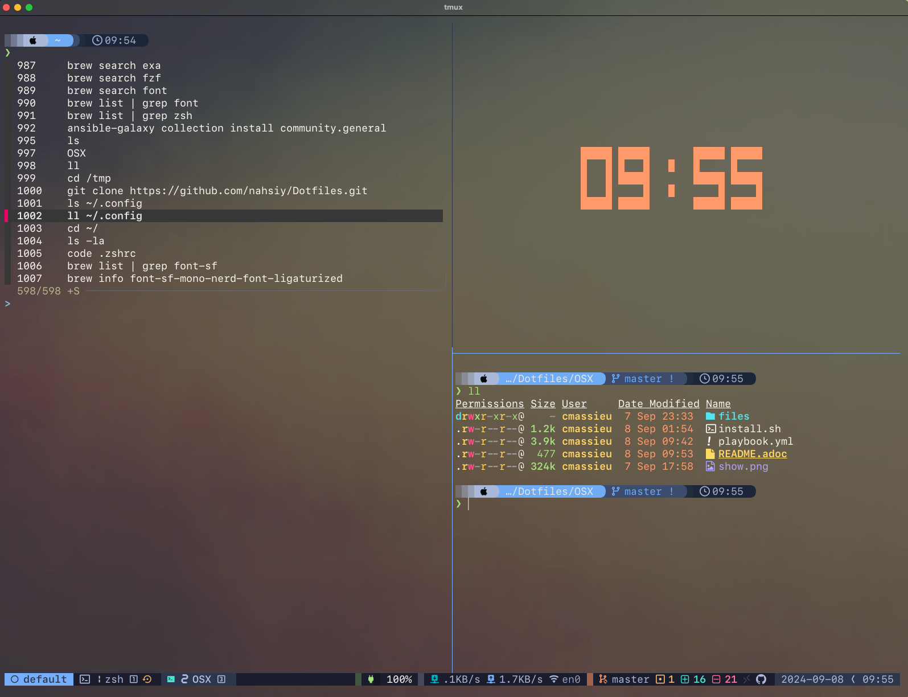

= My Terminal configuration on OSX

== Install

To install the terminal configuration, follow these steps:

* Open the Terminal app on macOS.
* Clone the repository by running the following command:

[source,shell]
----
cd /tmp
git clone https://github.com/nahsiy/Dotfiles.git
----

* Navigate to the cloned repository directory:

[source,shell]
----
cd Dotfiles/OSX/
----

* Run the installation script:

[source,shell]
----
bash install.sh
----

== Result

== Troubleshooting

Here are some solutions to common issues:

* [Task Install TPM plugins on error] - Restart the install.