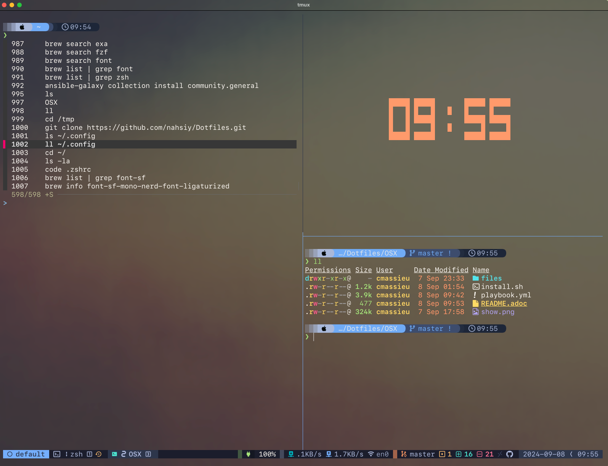

# Dotfiles

Mes configurations de terminal Linux et macOS, conservées au fil de mes
expérimentations avec Zsh, tmux, Vim, Neovim, WezTerm et Starship.

Ce dépôt présente un historique de configurations personnelles. Les scripts
d'installation datent de 2024 et ne sont pas validés sur les versions actuelles
de macOS et Homebrew.

## Contenu

| Chemin | Contenu |
| --- | --- |
| `.zshrc`, `.tmux.conf`, `.vimrc` | Configurations historiques du shell, de tmux et de Vim |
| `init.vim` | Configuration Neovim |
| `fastfetch/config.jsonc` | Présentation des informations système |
| `OSX/files/` | Configurations macOS : Zsh, tmux, Vim, WezTerm et Starship |
| `OSX/playbook.yml` | Ancienne automatisation du poste avec Ansible et Homebrew |
| `OSX/install.sh` | Script d'amorçage de cette automatisation |

## Parcourir les configurations

```bash
git clone https://github.com/nahsiy/Dotfiles.git
cd Dotfiles
```

Le clonage ne modifie pas la configuration du poste. Consultez les fichiers,
puis reprenez les éléments utiles après avoir sauvegardé vos propres réglages.

L'ancien installateur remplace plusieurs dotfiles, installe des paquets et
modifie les permissions de `/private/tmp`. Son playbook contient aussi des
chemins propres à un Mac Apple Silicon et à un utilisateur donné. Relisez et
adaptez ce parcours avant toute exécution ; il n'est pas une installation
universelle prête à lancer.

## Aperçu historique sur macOS



## À propos

[Mon profil GitHub](https://github.com/nahsiy) ·
[Mon portfolio](https://christophe-massieu.com/)
